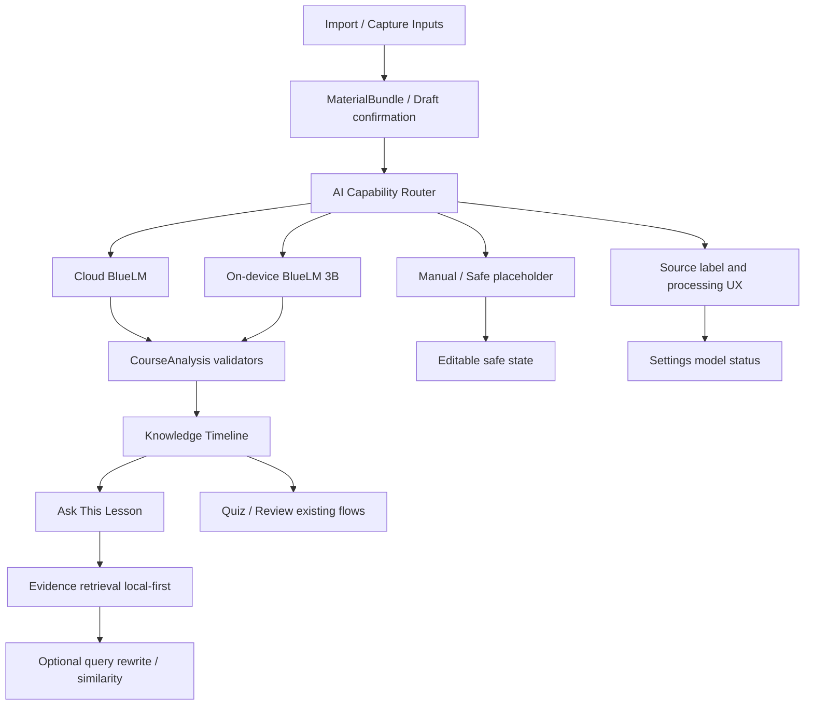

# P0 Claude Engineering Batch Pack

Status: ready for Claude implementation planning  
Scope: P0 Integrated Release, Learning AI Main Chain  
Source baseline: Stage 10 product UI + Stage 8E on-device BlueLM + official vivo AIGC docs capture  
Primary rule: this is an engineering handoff. It is not a feature implementation.

## P0 Batch Goal

P0 is one integrated release: make ClassMate's learning AI main chain explicit, routed, source-labelled, and user-confirmed.

The target chain is:

璧勬枡杈撳叆 -> AI Capability Router -> CourseAnalysis / Ask -> Evidence validation -> Knowledge Timeline -> user-visible source and fallback state.

This batch is not a broad product sprint. It only covers:

1. AI Capability Router adoption.
2. Cloud large model routing.
3. On-device BlueLM 3B fallback hardening.
4. Capture picker wiring for image and long-audio inputs.
5. Real OCR smoke v1.
6. Real ASR long-audio smoke v1.
7. Evidence-grounded Ask v1.
8. Retrieval providers v1.
9. AI Processing UX foundation.
10. Settings IA v1.

Out of P0:

Practice Generation, Weakness Hub, Export Study Report, Course Essence Audio Export, Image Generation, Video Generation, Ambient Loop Audio Player, Fast App, Final UI Optimization.

## Current Repo State Summary

### Already Implemented

- `AiCapabilityRouter` exists in `core/src/main/kotlin/com/classmate/core/ai/AiCapabilityRouter.kt`.
- Capability-specific router helpers exist in `core/src/main/kotlin/com/classmate/core/ai/LearningAiRouters.kt`.
- Capture domain models and provider interfaces exist under `core/src/main/kotlin/com/classmate/core/capture/`.
- Official OCR / ASR / query rewrite / similarity provider classes exist in `core/src/main/kotlin/com/classmate/core/capture/VivoCaptureProviders.kt`.
- App capture wiring exists in `app/src/main/java/com/classmate/app/capture/CaptureGateway.kt`.
- App config loading seam exists in `app/src/main/java/com/classmate/app/platform/CaptureConfigLoader.kt`.
- App transport exists in `app/src/main/java/com/classmate/app/data/AppCaptureTransport.kt`.
- Image learning draft flow exists in `ImportCourseScreen` and `AppViewModel`.
- On-device text and multimodal controller exists in `app/src/main/java/com/classmate/app/ondevice/OnDeviceLlmController.kt`.
- On-device CourseAnalysis path runs generated output through JSON parse and existing validators before persistence.
- Grounded Ask engine exists in `core/src/main/kotlin/com/classmate/core/ask/AskGrounded.kt`.
- Ask currently uses a composite seam: cloud provider chat followed by on-device Ask seam.
- qwen3.5-plus guard exists in `core/src/main/kotlin/com/classmate/core/provider/VendorIo.kt` and `BlueLMDiagnostic.kt`.

### Seam / Test Foundation Only

- `RoutedCourseAnalysisUseCase` exists but the visible `CourseAnalyzer` main chain still calls `ProviderResolver.providersInOrder()` directly.
- `RoutedAskUseCase` exists but app Ask currently uses `CompositeAskChatSeam` and `GroundedAskLessonEngine` rather than the explicit router result object.
- Capture providers exist, but OCR / ASR status and task lifecycle need cleaner user-facing wiring.
- Retrieval providers exist as reserved enhancement seams; local evidence retrieval is reliable, but official query rewrite / similarity must be verified against captured docs before being treated as production-ready.
- Settings contains many capabilities and diagnostics in one screen. It needs a minimal IA split without changing provider behavior.

### App-Integrated Today

- Text / OCR / transcript material tray is fused through `LessonMaterialAssembler`.
- `startAnalysis()` builds `LessonMaterialBundle` text and then invokes `CourseAnalyzer`.
- If cloud analysis fails, `AppViewModel.onDeviceAnalysisFallback()` tries on-device CourseAnalysis and persists only if validators pass.
- Image picker and camera thumbnail create an editable on-device multimodal draft; confirmation is required before analysis.
- Ask can call cloud provider chat and on-device Ask seam, then validates citations against local evidence.
- Settings exposes cloud model, on-device diagnostics, permissions, and debug diagnostics.

### Not Yet Fully Main-Chain Routed

- CourseAnalysis has fallback behavior, but the route decision is not yet represented as an `AiCapabilityResult`.
- Ask has fallback behavior, but the route decision is not yet represented as an `AiCapabilityResult`.
- Capture-to-analysis for official OCR / ASR needs end-to-end UI status and confirmation polish.
- Retrieval enhancement must stay local-first and optional; failures must never block Ask.
- AI processing UX is still stage/progress based and should become a clear processing modal or bottom sheet.

## File Map

### Core AI Routing

- `core/src/main/kotlin/com/classmate/core/ai/AiCapabilityRouter.kt`
- `core/src/main/kotlin/com/classmate/core/ai/LearningAiRouters.kt`

Use these as the source of truth for `CLOUD -> ON_DEVICE -> MANUAL / SAFE_PLACEHOLDER`.

### CourseAnalysis

- `core/src/main/kotlin/com/classmate/core/analysis/CourseAnalyzer.kt`
- `core/src/main/kotlin/com/classmate/core/analysis/CourseSegmenter.kt`
- `core/src/main/kotlin/com/classmate/core/provider/ProviderResolver.kt`
- `core/src/main/kotlin/com/classmate/core/provider/ProviderConfig.kt`
- `app/src/main/java/com/classmate/app/state/AppViewModel.kt`

P0 change target: make CourseAnalysis visible path adopt router semantics without weakening existing validation.

### Cloud Provider / BlueLM

- `core/src/main/kotlin/com/classmate/core/provider/VendorIo.kt`
- `core/src/main/kotlin/com/classmate/core/provider/BlueLMDiagnostic.kt`
- `core/src/main/kotlin/com/classmate/core/provider/BlueLMProvider.kt`
- `core/src/main/kotlin/com/classmate/core/provider/ProviderAskChatClient.kt`
- `app/src/main/java/com/classmate/app/data/BlueLMHttpTransport.kt`

P0 rule: do not change protocol unless required by a failing test. Keep qwen `enable_thinking=false`.

### On-device BlueLM

- `core/src/main/kotlin/com/classmate/core/ondevice/OnDeviceCourseAnalysis.kt`
- `core/src/main/kotlin/com/classmate/core/ondevice/OnDeviceAskChatSeam.kt`
- `core/src/main/kotlin/com/classmate/core/ondevice/OnDeviceLlmProvider.kt`
- `core/src/main/kotlin/com/classmate/core/ondevice/LocalProviderChain.kt`
- `app/src/main/java/com/classmate/app/ondevice/OnDeviceLlmController.kt`
- `app/src/main/java/com/classmate/app/ondevice/RealVivoOnDeviceLlmBridge.kt`

P0 rule: harden behavior through app/core seams. Do not rewrite SDK reflection bridge unless the specific task is a bridge bug fix.

### Capture / OCR / ASR / Retrieval

- `core/src/main/kotlin/com/classmate/core/capture/CaptureModels.kt`
- `core/src/main/kotlin/com/classmate/core/capture/CaptureProviders.kt`
- `core/src/main/kotlin/com/classmate/core/capture/CaptureUseCases.kt`
- `core/src/main/kotlin/com/classmate/core/capture/CaptureRouting.kt`
- `core/src/main/kotlin/com/classmate/core/capture/VivoCaptureProviders.kt`
- `app/src/main/java/com/classmate/app/capture/CaptureGateway.kt`
- `app/src/main/java/com/classmate/app/platform/CaptureConfigLoader.kt`
- `app/src/main/java/com/classmate/app/data/AppCaptureTransport.kt`

P0 target: image picker / camera and long-audio picker should produce editable drafts with clear source, then confirmation into CourseAnalysis.

### Ask / Evidence

- `core/src/main/kotlin/com/classmate/core/ask/AskGrounded.kt`
- `core/src/main/kotlin/com/classmate/core/ask/AskLesson.kt`
- `core/src/main/kotlin/com/classmate/core/evidence/`
- `core/src/main/kotlin/com/classmate/core/validation/`
- `app/src/main/java/com/classmate/app/state/AppViewModel.kt`

P0 target: Ask must be route-labelled and evidence-grounded across cloud and on-device.

### UI Surfaces

- `app/src/main/java/com/classmate/app/ui/screens/importcourse/ImportCourseScreen.kt`
- `app/src/main/java/com/classmate/app/ui/screens/course/CourseDetailScreen.kt`
- `app/src/main/java/com/classmate/app/ui/screens/settings/SettingsScreen.kt`
- `app/src/main/java/com/classmate/app/ui/components/`
- `app/src/main/java/com/classmate/app/navigation/ClassMateNavHost.kt`
- `app/src/main/java/com/classmate/app/state/Screen.kt`

P0 target: minimal IA and processing UX only. Do not start final visual redesign.

### Must Not Modify in P0 Without Explicit Bug Reason

- `core/src/main/kotlin/com/classmate/core/validation/**`
- `core/src/main/kotlin/com/classmate/core/evidence/**`
- SDK bridge internals beyond narrow bug fixes.
- Gradle files.
- `.github/**`.
- `app/libs/**`.
- `config.local.json`.
- `.codex_work/**`.

## Dependency Graph



Implementation dependency order:

1. Router result shape and source labels.
2. CourseAnalysis adoption.
3. Ask adoption.
4. Capture draft confirmation paths.
5. Retrieval enhancement.
6. UX processing modal.
7. Settings IA.

## Implementation Sequence

### Step 1: Freeze Safety Baseline

Checkpoint:

- `scripts\qa\current_preflight.ps1 -Quick` passes before edits.
- qwen guard still present.
- No tracked config/AAR/build outputs.

Do not continue if the baseline is already unsafe.

### Step 2: Wrap CourseAnalysis With Router Semantics

Goal:

- Keep current `CourseAnalyzer` validation and parsing behavior.
- Add a thin app/core adapter so the visible analysis flow returns source and route decision.
- Cloud stage calls the existing analyzer/provider chain.
- On-device stage calls `onDeviceController.analyzeCourse`.
- Terminal stage is safe placeholder UI state, not persisted fake analysis.

Checkpoint:

- Text import triggers CourseAnalysis through the route.
- Cloud success source is `CLOUD`.
- Cloud failure plus on-device success source is `ON_DEVICE`.
- Both failed source is `SAFE_PLACEHOLDER`, and no fake knowledge points are persisted.

### Step 3: Wrap Ask With Router Semantics

Goal:

- Keep `GroundedAskLessonEngine` citation validation.
- Use router result metadata for source label and fallback message.
- Local evidence retrieval remains mandatory.
- Optional official query rewrite / similarity only enhances candidate ordering.

Checkpoint:

- Ask with evidence returns grounded or partial with citations.
- Ask without evidence returns not_found.
- Cloud failure can fall to on-device evidence-bound answer.
- Model-free path shows safe evidence summary, not fabricated answer.

### Step 4: Wire Capture Picker Paths

Goal:

- Image picker / camera -> official OCR attempt + on-device image semantic draft.
- Audio picker -> official 1739 long-audio ASR task.
- Drafts are editable.
- Only user confirmation enters `ClassroomCaptureResult` and CourseAnalysis.

Checkpoint:

- Cancelled draft does not enter history, timeline, review, or export.
- Confirmed draft enters MaterialBundle and then CourseAnalysis.
- Missing OCR/ASR config does not block manual editing.

### Step 5: Real OCR Smoke v1

Goal:

- With capture config present, invoke official OCR provider.
- Without config, return ConfigMissing and keep on-device semantic draft/manual input available.
- Never claim semantic image draft is OCR.

Checkpoint:

- OCR success produces visible source `CLOUD`.
- OCR unavailable plus on-device draft produces visible source `ON_DEVICE`.
- Empty OCR and empty draft requires manual input.

### Step 6: Real ASR Long Audio Smoke v1

Goal:

- Use doc 1739 long-audio transcription path as first official ASR smoke.
- Surface task states: uploading, running, polling, success, failed.
- Manual pasted transcript stays available when config is missing or task fails.

Checkpoint:

- Audio draft can be edited before confirm.
- Manual transcript confirm enters CourseAnalysis.
- UI does not claim real-time classroom listening is complete.

### Step 7: Retrieval Providers v1

Goal:

- Keep local evidence retrieval as guaranteed path.
- Add optional query rewrite and text similarity only after endpoint/config parity is verified against captured official docs.
- Text vector provider can be interface-first if no vector store is ready.

Checkpoint:

- Provider failures do not block Ask.
- Retrieval logs contain only counts/enums, not question body or source text.

### Step 8: AI Processing UX Foundation

Goal:

- Replace generic long progress with a reusable processing sheet/modal.
- Show step, source, fallback transition, cancel/retry/manual edit actions.
- Keep visual work scoped; do not start final UI redesign.

Checkpoint:

- Long CourseAnalysis, OCR, ASR, and Ask operations show status.
- User can cancel or return to edit before persistence.

### Step 9: Settings IA v1

Goal:

- Split Settings into clearer groups or sub-pages.
- Do not change provider config logic.
- Developer diagnostics remain behind a developer/debug entry.

Checkpoint:

- Normal users see model status without raw debug fields.
- Developer options are explicit and folded.
- No key is displayed.

## Required UI / UX Behavior

### AI Processing Modal / Bottom Sheet

Required states:

- Waiting to start.
- Cloud processing.
- On-device fallback processing.
- Manual edit required.
- Validation failed.
- Success.
- Cancelled.

Example step labels:

- 姝ｅ湪鎻愮偧璇惧爞绮惧崕
- 姝ｅ湪璇嗗埆鍥剧墖鏂囧瓧
- 姝ｅ湪鐢熸垚鐭ヨ瘑鍦板浘
- 浜戠澶勭悊涓?- 鍒囨崲绔晶钃濆績缁х画澶勭悊
- 绛夊緟浣犵‘璁ゅ涔犺祫鏂?
Required fields:

- Capability: CourseAnalysis / Ask / OCR / ASR.
- Source: CLOUD / ON_DEVICE / MANUAL / SAFE_PLACEHOLDER.
- Current step.
- Retry action.
- Cancel action.
- Continue manual edit action.
- Safe short error code.

Do not show:

- Full prompt.
- Provider request/response body.
- Course full text in logs.
- reasoning content.
- Authorization header.
- AppID / AppKEY / API key.

### Source Labels

Every AI-visible output must show a safe source label:

- 浜戠钃濆績 for `CLOUD`.
- 绔晶钃濆績 for `ON_DEVICE`.
- 鎵嬪姩 for `MANUAL`.
- 瀹夊叏鍗犱綅 for `SAFE_PLACEHOLDER`.

### User Confirmation

Confirmation required before persistence:

- CourseAnalysis generated from imported/captured material.
- Image learning draft.
- OCR result.
- ASR transcript.
- Practice/review generated content if later included outside P0.

Confirmation not required:

- Ask answer display, but the answer must still show evidence and source.
- Retrieval candidate ordering.

## Settings Multi-page IA

Minimal P0 structure:

### Settings Home

- Model status summary.
- Privacy / safety summary.
- Theme entry.
- Model access entry.
- Learning/export entry.
- Developer options entry.

### Theme Settings

- Focus theme.
- Flow theme entry for companion modes.
- Vitality theme as optional later direction.
- Theme color preview.
- Ambient background audio entry only as later authorized-loop-audio setting, not AI generation.

### Model Access

- Cloud BlueLM status.
- On-device BlueLM status.
- OCR provider config status.
- ASR provider config status.
- Capture config status.
- Source explanation: Cloud -> On-device -> Manual / Safe placeholder.

### Learning and Export

- Default analysis preferences.
- Default export format.
- AI concise/detailed preference.
- User confirmation policy summary.

### Developer Options

- Cloud diagnostic.
- On-device text diagnostic.
- On-device multimodal diagnostic.
- OCR/ASR smoke.
- Provider status.
- Safe logs.
- Debug import.

Developer options must not expose raw credentials or raw provider payloads.

## Cloud / On-device / Manual Integration Rules

1. Generative learning tasks use cloud first, then on-device, then manual or safe placeholder.
2. Specialized input recognition uses official specialized service first, then on-device semantic fallback if the modality is supported, then manual editable fallback.
3. Every result must carry one of: `CLOUD`, `ON_DEVICE`, `MANUAL`, `SAFE_PLACEHOLDER`.
4. Any result that enters materials, CourseAnalysis, knowledge map, quiz, review, or practice must be explicitly confirmed or validator-gated.
5. Local deterministic fallback must be described as safe placeholder or manual support, not as intelligence.
6. On-device multimodal image draft is semantic understanding, not OCR.
7. Manual paste is not ASR.
8. Real-time ASR must not be claimed unless it is actually implemented and verified.

## Security Rules

- Do not read `config.local.json` content.
- Do not print or store AppID / AppKEY / API key.
- Do not hardcode credentials.
- Do not submit `.codex_work`.
- Do not submit AAR files.
- Do not direct-import the vivo SDK outside the approved reflection bridge pattern.
- Keep qwen3.5-plus `enable_thinking=false`.
- Provider integration must read config through existing config seams.
- UI can show credential presence only, never values.
- Logs may contain enum/status/count/latency/source only.
- Export/history/learning state must not contain prompts, messages, vendor bodies, or reasoning text.
- Captured image/audio/text enters persistence only after user confirmation and/or validator pass.

## Forbidden Wording

Avoid obsolete or exaggerated current-baseline wording. In UI, docs, logs, and demo scripts:

- Do not present deterministic local rules as an intelligent model.
- Do not describe a rule-only path as a smart fallback.
- Do not say local rule analysis is a learning AI path.
- Do not imply an on-device result is the same as `LOCAL_FALLBACK`.
- Do not claim image semantic draft is OCR.
- Do not claim automatic OCR is complete before official OCR is actually wired and verified.
- Do not describe DeepSeek or Compatible mode as the competition main path.
- Do not claim real ASR, voiceprint recognition, denoising, or automatic speaker diarization is complete unless the feature is actually implemented and verified.

Use safe wording:

- 瀹夊叏鍗犱綅
- 鎵嬪姩缂栬緫
- 绔晶璇箟鑽夌
- 瀹樻柟 OCR 灏濊瘯
- 闀胯闊宠浆鍐欎换鍔?- 寰呴厤缃?/ 寰呴獙璇?/ 瀹為獙妯″紡

## Tests Required

### Core Unit Tests

- Router returns cloud success when cloud stage produces.
- Router falls to on-device when cloud fails.
- Router falls to safe placeholder when both fail.
- CourseAnalysis adapter does not persist safe placeholder as analysis result.
- On-device accepted CourseAnalysis still passes existing validators.
- On-device rejected CourseAnalysis preserves original cloud failure and source report.
- Ask adapter returns source label for cloud / on-device / manual.
- Ask with no evidence returns not_found.
- Query rewrite failure falls back to original query.
- Similarity failure falls back to local candidate order.

### App Unit Tests

- `startAnalysis()` uses routed source reporting.
- Confirmed image draft enters CourseAnalysis.
- Cancelled image draft does not enter history.
- Confirmed transcript draft enters CourseAnalysis.
- Missing capture config keeps manual transcript path available.
- Processing sheet states render safe labels.
- Settings model page separates cloud / on-device / OCR / ASR status.
- Developer options do not show raw key fields.

### Safety Tests

- No logs contain AppID / AppKEY / API key / Authorization / provider body.
- No exported report contains prompt / messages / reasoning content.
- qwen guard remains in provider request factory and diagnostic request.
- Manifest permissions are reviewed but not expanded accidentally.
- `config.local.json` and AAR stay untracked.

### Smoke Tests

- Cloud CourseAnalysis success path.
- Cloud failure -> on-device CourseAnalysis success path.
- Cloud failure + on-device validation failure -> safe placeholder, no persistence.
- Image picker -> draft -> confirm -> CourseAnalysis.
- Camera -> draft -> cancel -> no persistence.
- Audio picker -> ASR task states -> transcript draft.
- Manual transcript -> confirm -> CourseAnalysis.
- Ask grounded / partial / not_found.

## Commands Required

Minimum after implementation:

```powershell
scripts\qa\current_preflight.ps1 -Quick
.\gradlew.bat :core:test
.\gradlew.bat :app:testDebugUnitTest
.\gradlew.bat :app:assembleDebug
scripts\secrets_scan\secrets_scan.ps1
bash scripts/secrets_scan/secrets_scan.sh
git diff --check
git ls-files config.local.json local.properties secrets.properties .env .env.* *.jks *.keystore *.apk *.aab app/build core/build build .gradle .codex_work .vscode
```

Device smoke:

```powershell
scripts\qa\stage8c_device_helper.ps1 -AllLight
```

Use additional Stage 8/Stage 10 proof scripts only after build health is confirmed.

## Acceptance Criteria

### A. CourseAnalysis

- User imports text, image, or audio-derived text and confirms the content.
- Confirmed content enters `CourseAnalysis`.
- CourseAnalysis uses router semantics.
- Cloud success is labelled `CLOUD`.
- Cloud failure attempts on-device BlueLM 3B.
- On-device accepted output is labelled `ON_DEVICE`.
- On-device output must parse JSON and pass validators before landing.
- Both failed states produce `SAFE_PLACEHOLDER` UI only; no fake analysis is persisted.

### B. Ask

- Ask answers are grounded in current lesson evidence.
- Cloud answer is labelled `CLOUD`.
- Cloud failure attempts on-device evidence-bound answer.
- On-device answer is labelled `ON_DEVICE`.
- No evidence returns `not_found` and does not fabricate facts.
- Optional query rewrite / similarity can enhance retrieval but cannot bypass local evidence validation.

### C. OCR

- Image input can attempt official OCR when configured.
- OCR unavailable returns a safe config/failure state.
- On-device image semantic draft remains available as a separate track.
- User can edit and confirm the draft.
- Confirmed text enters MaterialBundle and CourseAnalysis.
- UI never says semantic image draft is OCR.

### D. ASR

- Audio input can enter 1739 long-audio task flow.
- UI shows uploading / running / polling / success / failed.
- Missing config offers pasted transcript/manual edit path.
- Confirmed transcript enters MaterialBundle and CourseAnalysis.
- UI does not claim real-time classroom listening is complete.

### E. AI Processing UX

- Long tasks show a processing modal/sheet, not only a generic progress bar.
- Modal shows capability, step, source, fallback transition, cancel, retry, and manual edit.
- Errors are short and safe.
- No prompt, body, credential, full course text, or reasoning text is shown.

### F. Settings

- Settings is split into multi-level groups or clear sub-page entries.
- Model access page shows cloud / on-device / OCR / ASR status.
- Developer options are separate from ordinary settings.
- Raw credentials are never displayed.

### G. Safety

- `config.local.json` is never read or printed during implementation.
- No credential is hardcoded.
- `.codex_work` is not committed.
- SDK bridge is not rewritten casually.
- Existing validators are not weakened.
- qwen `enable_thinking=false` remains.
- ASR/OCR wording stays honest.

## Rollback Plan

Rollback should be possible by feature slices:

1. Router adoption slice:
   - Revert CourseAnalysis / Ask adapters while keeping existing analyzer and Ask engine.
2. Capture slice:
   - Disable official OCR/ASR buttons and keep manual text/transcript input.
3. Processing UX slice:
   - Fall back to existing analysis screen with safe source labels.
4. Settings IA slice:
   - Revert to existing Settings card layout without touching provider config.

Never roll back by deleting validators, provider config, qwen guard, or on-device diagnostics.

## Suggested Claude Prompt Seed

Use this as a short seed, then paste the concrete sections above as needed:

> Implement P0 Integrated Release: Learning AI Main Chain. Adopt existing `AiCapabilityRouter` for CourseAnalysis and Ask, wire cloud -> on-device -> safe/manual source-labelled outcomes, connect confirmed image/audio capture drafts into CourseAnalysis, add minimal AI processing UX and Settings IA split. Do not weaken validators, do not change BlueLM protocol, keep qwen enable_thinking=false, do not read config.local.json, do not commit .codex_work or AAR, and keep ASR/OCR wording honest.

## Suggested Commit Message

```text
feat(ai): route learning chain through cloud and on-device capabilities
```

If split into smaller commits:

```text
feat(ai): adopt capability router for course analysis and ask
feat(capture): wire OCR and ASR drafts into confirmed learning inputs
feat(ui): add AI processing state and settings IA foundation
```
